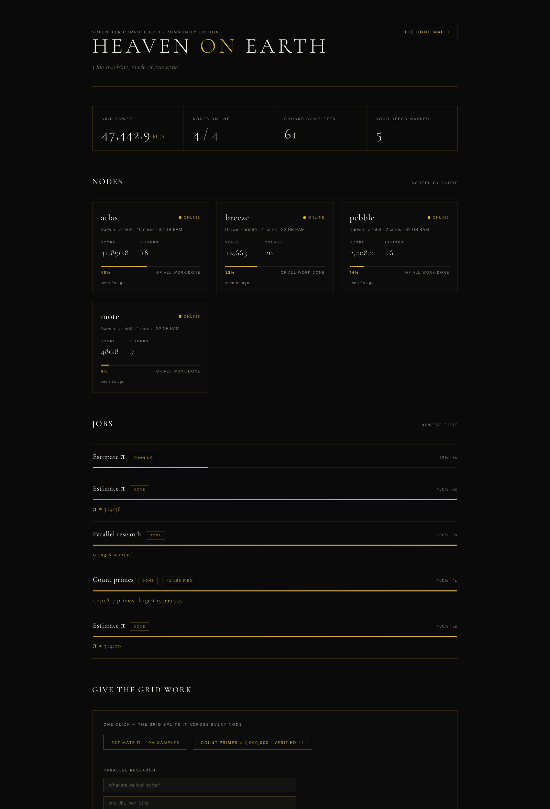
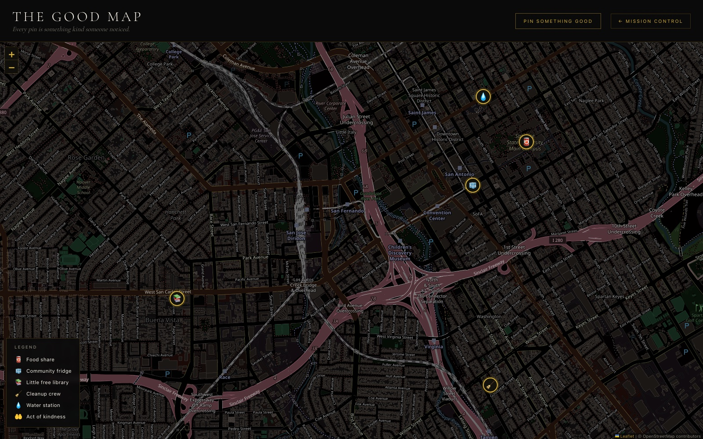

# Heaven on Earth

**One machine, made of everyone.**

Somewhere near you, a computer is doing nothing. Somewhere near you, someone left canned food on a ledge for whoever needs it. Heaven on Earth is about noticing both.

This is two things in one small repo:

1. **A volunteer computing grid.** Any computer running Python 3.8+ joins with one command and becomes part of one big machine. Work is divided by how good each computer actually is, and research runs in parallel across the grid.
2. **The Good Map.** A neighborhood map of everyday kindness — a community fridge, a little free library, someone leaving canned food on a wall for whoever needs it. Anyone on the grid's network can pin something good they noticed.

Compute for good, and noticing good. Zero dependencies. Pure Python standard library. MIT licensed.



*A real run on a 4-node grid: 100,000,000 Monte Carlo samples in 2.9 s, and π(20,000,000) = 1,270,607 primes with every unit computed twice and verified — the strongest node took 58.8% of the work, the weakest 3.1%, nobody had to configure anything.*

This is v0.1 — brand new, built in public, and honest about it (see [Limitations](#honest-v01-limitations)).

## Quickstart

```bash
git clone https://github.com/Yusuf-Gadelrab/heaven-on-earth && cd heaven-on-earth
python3 coordinator.py                          # on the hub machine
python3 worker.py --join http://<hub-ip>:8940   # on every computer you can find
python3 submit.py pi --samples 10000000 --watch # from anywhere
```

No `pip install`. No `requirements.txt`. If it has Python 3.8+, it can join.

The coordinator serves the gold/black **Mission Control** dashboard at http://localhost:8940 and **The Good Map** at http://localhost:8940/good.

### Try it on one machine first

```bash
bash demo.sh
```

The demo spins up a coordinator plus two workers — one artificially throttled to 25% speed to play the "old laptop" — estimates π, then counts primes below 1.5M with ×2 verification, and prints each node's share of the work so you can *see* the strong machine take the bigger slice.

## How it works

- **`coordinator.py`** — the hub. Pure Python stdlib (`ThreadingHTTPServer` + SQLite). Serves the dashboard, the Good Map, and the HTTP API the grid runs on.
- **`worker.py`** — the volunteer node. Pure stdlib. On start it benchmarks itself (SHA-256 hashing rate × cores → a capability score in kH/s), registers with the coordinator, then pulls work in a loop. Node identity persists in `~/.heaven/<name>.json`, so a node keeps its name and history across restarts.
- **`submit.py`** — the CLI for giving the grid work and watching it: a live progress bar and, on completion, the answer plus each node's share of the work.
- **`tasks.py`** — the complete whitelist of everything a worker can ever run.

### Capability-proportional scheduling

Work units are cut **at claim time**, sized by the claiming node's benchmark score relative to the current online average (clamped 0.25×–4×). A Mac Studio gets big slices; an old laptop gets small ones. Because workers *pull* work rather than being assigned it, fast machines simply come back for more — the grid load-balances itself without a scheduler to tune. Chunks that time out (180s) are reclaimed and reissued automatically, so a node dying mid-chunk never stalls a job.

### Verification by redundancy

Submit a job with `--redundancy 2` and every unit is computed by two different nodes when possible. Results must match **byte-for-byte** — task math is deterministic by design (even the Monte Carlo tasks are seeded) — or both results are discarded and the unit is reissued. Single-node grids fall back to self-verification rather than deadlocking.

### Whitelisted tasks only — this is the security model

A worker can only ever run the functions in `tasks.py`, shipped with the code. The grid **never** downloads or executes arbitrary code from the network — that's how you build a botnet, not a commons. New task types arrive by pull request and must be deterministic and verifiable.

## Task types in v0.1

| Task | What it does |
|---|---|
| `monte_carlo_pi` | Seeded Monte Carlo π estimate |
| `prime_count` | Segmented-sieve prime counting over a range |
| `research_fetch` | Parallel research: each node fetches one URL, strips it to text, extracts the title and the sentences matching your query — the grid reads many sources simultaneously and merges the findings |

## CLI

```bash
# Estimate π across the grid, watch it live
python3 submit.py pi --samples 10000000 --watch

# Count primes below 2M, every unit verified by two nodes
python3 submit.py primes --end 2000000 --redundancy 2 --watch

# Read many sources at once
python3 submit.py research --query "solar balcony panels" --urls https://a.com,https://b.org --watch

# Re-attach to a running job
python3 submit.py watch <job-id>
```

Worker flags:

- `--name` — pick the node's name (identity persists in `~/.heaven/<name>.json`)
- `--cores` — cap how many cores the node uses
- `--throttle 0.5` — run at partial speed (be polite on a shared machine, or simulate weak hardware)
- `--poll` — how often to ask the coordinator for work

## The Good Map

The same coordinator, the same SQLite database, a different kind of good: a map of everyday kindness in your neighborhood. Leaflet + OpenStreetMap tiles (restyled dark), at `/good`.



Categories in v0.1: **food share** · **community fridge** · **little free library** · **cleanup crew** · **water station** · **act of kindness**.

Anyone on the grid's network can pin something good they noticed. It ships with a few clearly-marked sample pins around San Jose so the map isn't empty on first run.

## Honest v0.1 limitations

- **Trust model is "your own machines / a LAN you trust."** There are no auth tokens and no TLS yet. Do not expose the coordinator to the open internet.
- **No NAT traversal.** Workers must be able to reach the coordinator's IP directly.
- **Redundancy on a 1-node grid degrades to self-verification** — the same node checks its own work, which catches crashes and nondeterminism bugs but not a malicious node.
- **The Good Map has no moderation or accounts yet.** Anyone who can reach the coordinator can pin.
- **`work_share` mixes jobs into one normalized number** — it's a fair picture of overall contribution, not a per-job accounting.

## Roadmap

- Browser workers (WASM sandbox) — so a phone in a drawer can join
- Idle-only scheduling — only compute when the machine is unused
- Node reputation + majority-of-3 arbitration
- Auth tokens + TLS + a relay, for joining across the internet
- Task packs for public-interest research — the BOINC spirit, modern DX
- Good Map photos, moderation, and a mobile PWA
- A public "commons" grid where donated cycles run vetted nonprofit workloads

## Contribute

Three ways in, pick any:

1. **Run a node.** `python3 worker.py --join http://<hub>:8940` on the laptop in your drawer.
2. **Contribute a task pack.** Deterministic, verifiable, stdlib-only — see [CONTRIBUTING.md](CONTRIBUTING.md).
3. **Pin something good.** Open `/good` and mark the community fridge you walked past today.

Architecture deep-dive: [docs/ARCHITECTURE.md](docs/ARCHITECTURE.md).

## License

MIT © 2026 [Yusuf Gadelrab](https://github.com/Yusuf-Gadelrab). See [LICENSE](LICENSE).
